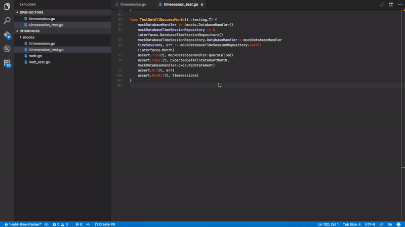

# Golang TDD red green

Missing green and red lights on your tdd when developing in Golang? Here they are. Golang TDD gets green when tests for the current package passes and red otherwise. All of this on save.

## Features

## Release Notes

### 0.0.1

Initial release
